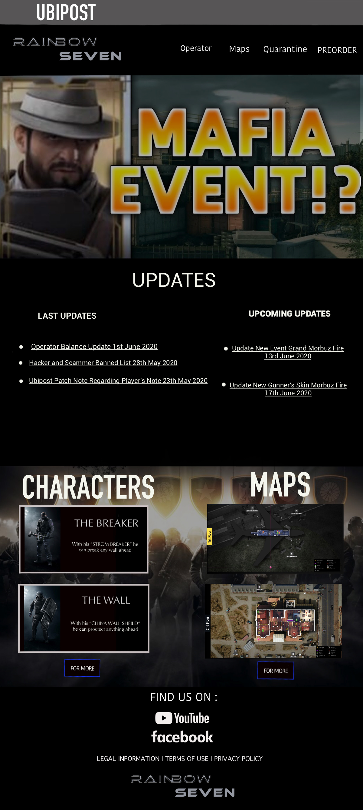

# RainbowSeven-Website
This is a project to fulfill requirement in Human Computer Interaction Subject at Bina Nusantara University.

## Descriptions
This website is an imitation from real website "Rainbow Six", and provides information about the game (maps, characters, etc). 
Please have a quick look with project's preview below. Thank you!

## Run Guide
This project using HTML and CSS, so you can run it directly

## Project's Preview

 

## Technologies
▸ HTML 
▸ CSS 
▸ Javascript 
▸ Visual Studio Code 
